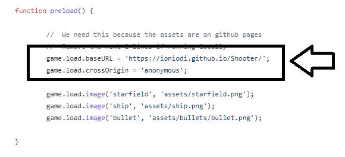

# Δημιουργία Shooter

Σκοπός της εργασίας είναι να επεκτείνεις το Shooter --ένα HTML5 video game--. Για τον σκοπό αυτό θα χρησιμοποιήσουμε τη βιβλιοθήκη [Phaser](http://phaser.io/). Για την εργασία θα στηριχθείς σε ένα υπάρχον παιχνίδι το Shooter και στη συνέχεια θα πρέπει να το επεκτείνεις. Για την ανάπτυξη του παιχνίδιου μπορείς να χρησιμοποιήσεις μόνο το github ή/και έναν απλό επεξεργαστή κειμένου. Αρχικά θα πρέπει να δημιουργήσεις ένα αντίγραφο (fork) του [αποθετηρίου](https://github.com/ioniodi/Shooter) του παιχνιδίου και στη συνέχεια να υλοποιήσεις τα ζητούμενα όπως περιγράφονται στα ανοιχτά [issues](https://github.com/ioniodi/Shooter/issues) της εργασίας.

## Initial Settings
- Από την στιγμή που έχεις κάνει αντιγραφή (fork) το [αποθετήριο](https://github.com/ioniodi/Shooter) του παιχνιδιού, θα πρέπει να έχει κατέβει στο προσωπικό σου github αποθετήριο ο [κώδικας του παιχνιδιού](index.html) και ο φάκελος [assets](/assets/) με τα αντικείμενα (εικόνες, ήχοι, κτλ) που θα χρησιμοποιήσεις στο παιχνίδι σου.

- Ενεργοποίησε το Github Pages στα setting του προσωπικού σου repository και *άλλαξε το λινκ στην κορυφή του αποθετηρίου σου ώστε να δείχνει στην σελίδα του παιχνιδιού σου.*

- Στο [index.html](index.html) άλλαξε το ioniodi με το δικό σου username.

## Notes
- Στην περίπτωση που κάποιος θέλει εναλλακτικά να τρέξει το παιχνίδι **τοπικά** μπορεί να ακολουθήσει τις οδηγίες από το [επίσημο site](http://phaser.io/tutorials/getting-started/index). Προτεινόμενος local web server: [xampp](https://www.apachefriends.org/index.html). Editor μπορείτε να βρείτε από [εδώ](http://phaser.io/tutorials/getting-started-phaser2/part4) ή να χρησιμοποιήσετε το [eclipse](http://www.eclipse.org/) ακολουθώντας τις οδηγίες που δίνονται [εδώ](http://www.html5gamedevs.com/topic/22688-setting-up-eclipse-to-work-with-phaser-how-to/). 

**Προσοχή:** Για να βαθμολογηθεί το παιχνίδι πρέπει να βρίσκεται υποχρεωτικά στην προσωπική σας github page.

## Βαθμολόγηση
- Αλλαγές στο παιχνίδι όπως περιγράφονται στο [παραδοτέο 1](https://github.com/ioniodi/Shooter/issues/1): μέχρι 4. 
- Σημαντικές αλλαγές στο παιχνίδι όπως περιγράφονται στο [παραδοτέο 2](https://github.com/ioniodi/Shooter/issues/2): μέχρι 8.
- [Aξιολόγηση από ομότιμους](https://github.com/ioniodi/Shooter/issues/3): 9-10.

## Resources
- [Phaser Tutorial](http://phaser.io/learn)
- [Official Phaser Tutorials](https://phaser.io/learn/official-tutorials)
- [Phaser Examples](http://phaser.io/examples)
- [Javascript tutorial](http://www.w3schools.com/js/)
- [PHASERFIRE](http://codeperfectionist.com/portfolio/games/phaserfire/)
